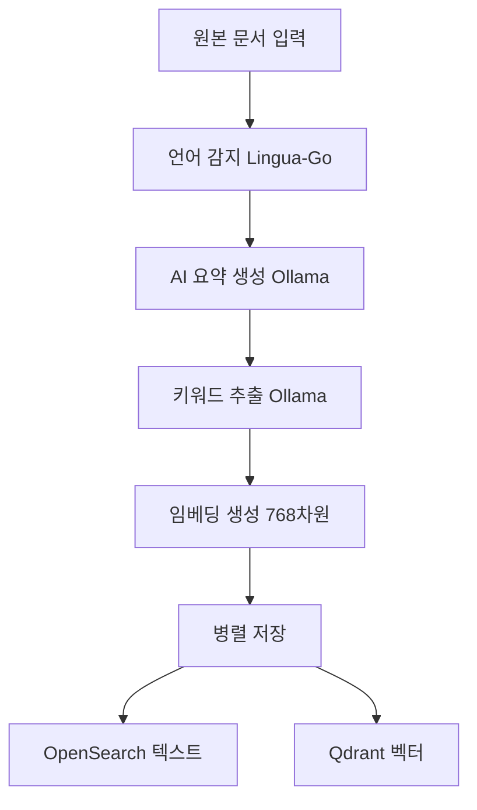
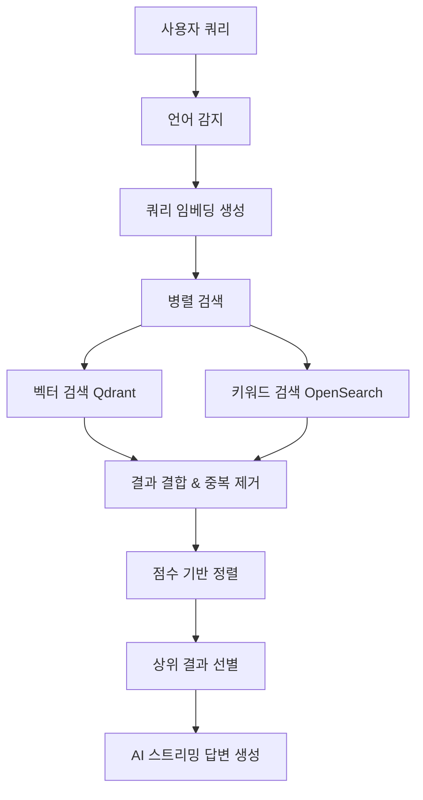

# Open Librarian 🔍

**AI 기반 지능형 문서 검색 플랫폼**

Open Librarian은 최신 AI 기술을 활용한 하이브리드 검색 시스템으로, 벡터 검색과 키워드 검색을 지능적으로 결합하여 정확하고 의미론적으로 관련성 높은 검색 결과를 제공합니다. 실시간 스트리밍 AI 답변 생성, 8개 언어 지원, 그리고 직관적인 웹 인터페이스를 통해 사용자에게 최고의 검색 경험을 선사합니다.

## ✨ 주요 특징

- 🤖 **하이브리드 AI 검색**: 벡터 검색(60%) + 키워드 검색(40%) 가중 결합으로 최적의 정확도 실현
- 🌐 **실시간 스트리밍 답변**: WebSocket 기반 실시간 AI 답변 생성 및 진행률 추적
- 🌍 **8개 언어 완전 지원**: 한국어, 영어, 일본어, 중국어, 스페인어, 프랑스어, 독일어, 러시아어
- 📱 **반응형 모던 UI**: Tailwind CSS 기반 모바일 우선 설계 + 다크모드 지원
- 🚀 **고성능 병렬 처리**: 벡터/키워드 검색 동시 실행, 배치 인덱싱, 결과 캐싱
- 📄 **대량 문서 처리**: JSONL 형식 배치 업로드 및 실시간 진행률 모니터링
- 🔍 **정확한 언어 감지**: Lingua-Go 기반 자동 언어 감지 및 언어별 최적화
- 📊 **개발자 친화적**: Swagger API 문서, 상세한 로깅, 헬스 체크 지원

## 🏗️ 시스템 아키텍처

### 핵심 구성 요소

```
                          🌐 Open Librarian Architecture

    ┌─────────────────────┐     ┌─────────────────────┐     ┌─────────────────────┐
    │  🚀 Go API Server   │     │  🔍 OpenSearch      │     │  🧠 Qdrant Vector   │
    │                     │◄────┤                     │     │                     │
    │  • HTTP/WebSocket   │     │  • 키워드 검색       │     │  • 768차원 임베딩    │
    │  • 비즈니스 로직     │     │  • 다국어 분석기     │◄────┤  • 코사인 유사도     │
    │  • 실시간 스트리밍   │     │  • BM25 스코링      │     │  • gRPC 통신        │
    │  • RESTful API      │     │  • 전문 검색        │     │  • 벡터 검색        │
    └─────────────────────┘     └─────────────────────┘     └─────────────────────┘
              │                                                       ▲
              │                                                       │
              ▼                                                       │
    ┌─────────────────────┐                             ┌─────────────────────┐
    │  🤖 Ollama LLM      │                             │  📱 Frontend UI     │
    │                     │                             │                     │
    │  • Gemma 3 (12B)    │                             │  • Vanilla JS       │
    │  • 임베딩 생성       │─────────────────────────────┤  • Tailwind CSS     │
    │  • 요약 & 답변 생성  │                             │  • WebSocket 연결   │
    │  • 스트리밍 응답     │                             │  • IndexedDB 캐시   │
    │  • 다국어 지원       │                             │  • 반응형 디자인     │
    └─────────────────────┘                             └─────────────────────┘

    ┌─────────────────────────────────────────────────────────────────────────────┐
    │                         🔄 Data Flow                                        │
    │  사용자 쿼리 → 언어감지 → 임베딩생성 → 병렬검색 → 결과결합 → AI답변생성        │
    └─────────────────────────────────────────────────────────────────────────────┘
```

### 기술 스택

| 카테고리 | 기술 스택 | 버전 | 용도 |
|---------|----------|------|------|
| **Backend** | Go | 1.24+ | 고성능 API 서버 |
| **Web Framework** | Chi Router | v5.2+ | 라우팅 및 미들웨어 |
| **Vector DB** | Qdrant | Latest | 768차원 임베딩 저장/검색 |
| **Search Engine** | OpenSearch | 2.13.0 | 전문 검색 및 분석 |
| **AI/LLM** | Ollama | Latest | 로컬 LLM 서버 |
| **Language Detection** | Lingua-Go | v1.4+ | 8개 언어 감지 |
| **Frontend** | Vanilla JS + Tailwind | Latest | 현대적 웹 UI |
| **Real-time** | WebSocket + SSE | Native | 실시간 통신 |
| **Container** | Docker + Compose | Latest | 컨테이너화 배포 |

### 백엔드 구조

#### 🏗️ Go 서버 아키텍처
```
lib/aggregator/api/
├── api.go              # 핵심 비즈니스 로직 및 AI 처리
└── handlers.go         # HTTP/WebSocket 핸들러

lib/client/
├── ollama/            # Ollama AI 클라이언트 (HTTP API)
├── opensearch/        # OpenSearch 검색 엔진 클라이언트
└── qdrant/           # Qdrant 벡터 DB 클라이언트 (gRPC)

lib/util/
└── language/         # Lingua-Go 기반 다국어 감지
```

#### 🔧 주요 컴포넌트
- **API Server**: Chi 라우터 기반 RESTful API 및 WebSocket 지원
- **Search Aggregator**: 벡터 + 키워드 검색 결과 통합 처리
- **AI Pipeline**: 문서 요약, 키워드 추출, 임베딩 생성
- **Progress Tracking**: 실시간 작업 진행률 추적 시스템

### 프론트엔드 구조

#### 📱 클라이언트 아키텍처
```
cmd/server/public/
├── index.html         # 메인 HTML 템플릿
├── css/styles.css     # 커스텀 스타일
└── js/
    ├── app.js         # 앱 초기화 및 메인 로직
    ├── search.js      # 검색 기능 (HTTP/WebSocket)
    ├── articles.js    # 문서 추가 및 배치 업로드
    ├── ui.js          # UI 상태 관리 및 네비게이션
    ├── database.js    # IndexedDB 로컬 저장소
    └── i18n.js        # 다국어 지원 (5개 언어)
```

#### 🎨 UI 특징
- **반응형 디자인**: Tailwind CSS 기반 모바일 우선 설계
- **실시간 업데이트**: WebSocket으로 검색/업로드 진행률 표시
- **오프라인 지원**: IndexedDB를 활용한 검색 히스토리 캐싱
- **다국어 UI**: 한국어, 영어, 중국어, 일본어, 스페인어 지원

## 🔬 핵심 기능 및 원리

### 1. 하이브리드 검색 시스템

Open Librarian의 핵심은 두 가지 검색 방식을 결합한 하이브리드 접근법입니다:

#### 🔍 벡터 검색 (Semantic Search)
- **원리**: 문서와 쿼리를 768차원 벡터로 변환하여 의미적 유사성 측정
- **구현**: Ollama `paraphrase-multilingual` 모델로 임베딩 생성 → Qdrant에서 코사인 유사도 검색
- **장점**: 동의어, 유사 개념, 문맥적 의미 이해
- **적용 영역**: 제목 + 요약 벡터 검색으로 정확도 향상

#### 📝 키워드 검색 (Lexical Search)
- **원리**: BM25 알고리즘 기반 전통적 텍스트 매칭
- **구현**: OpenSearch의 다국어 분석기 활용 (Nori, Kuromoji, SmartCN 등)
- **장점**: 정확한 용어 매칭, 빠른 검색 속도
- **적용 영역**: 제목, 내용, 요약 필드에서 다국어 전문 검색

#### 🧮 하이브리드 점수 결합 알고리즘
```go
// 실제 구현된 점수 결합 알고리즘 (벡터 60%, 키워드 40% 가중평균)
func (s *Server) combineSearchResults(vectorResults []qdrant.VectorSearchResult, 
    vectorArticles []opensearch.Article, keywordResults []opensearch.SearchResult, 
    limit int) []SearchResultWithScore {
    
    const minScoreThreshold = 0.55 // 품질 필터링을 위한 최소 점수 임계값

    // 검색 결과 결합 및 중복 제거
    resultMap := make(map[string]SearchResultWithScore)
    
    // 벡터 검색 결과 추가
    for _, result := range vectorResults {
        articleID := s.extractArticleID(result.ID)
        if article, exists := vectorArticleMap[articleID]; exists {
            resultMap[articleID] = SearchResultWithScore{
                Article: article,
                Score:   result.Score, // 벡터 점수는 이미 0-1 정규화됨
                Source:  "vector",
            }
        }
    }
    
    // 키워드 검색 결과 추가 (중복 시 점수 결합)
    for _, result := range keywordResults {
        if existing, exists := resultMap[result.Article.ID]; exists {
            // 정규화된 점수를 가중평균으로 결합: 벡터 60%, 키워드 40%
            normalizedVectorScore := existing.Score
            normalizedKeywordScore := s.normalizeKeywordScore(result.Score)
            combinedScore := (0.6 * normalizedVectorScore) + (0.4 * normalizedKeywordScore)
            
            resultMap[result.Article.ID] = SearchResultWithScore{
                Article: result.Article,
                Score:   combinedScore,
                Source:  "hybrid",
            }
        } else {
            resultMap[result.Article.ID] = SearchResultWithScore{
                Article: result.Article,
                Score:   s.normalizeKeywordScore(result.Score),
                Source:  "keyword",
            }
        }
    }
    
    // 최소 점수 임계값 필터링 및 점수 기준 정렬
    var combinedResults []SearchResultWithScore
    for _, result := range resultMap {
        if result.Score >= minScoreThreshold {
            combinedResults = append(combinedResults, result)
        }
    }
    
    return combinedResults[:min(len(combinedResults), limit)]
}

// BM25 점수를 0-1 범위로 정규화
func (s *Server) normalizeKeywordScore(score float64) float64 {
    if score <= 0 {
        return 0.0
    }
    // 로그 스케일링: log(1 + score) / log(1 + max_expected_score)
    maxExpectedScore := 20.0
    normalized := math.Log(1+score) / math.Log(1+maxExpectedScore)
    return math.Min(1.0, math.Max(0.0, normalized))
}
```

### 2. AI 기반 문서 처리 파이프라인

#### 📄 문서 인덱싱 프로세스


**진행률 추적**: WebSocket을 통한 실시간 처리 상태 업데이트
- 언어 감지 → 요약 생성 → 키워드 추출 → 임베딩 생성 → 저장

#### 🔎 검색 및 답변 생성 프로세스


### 3. 실시간 스트리밍 시스템

#### 🌊 WebSocket 기반 실시간 처리
- **검색 스트리밍**: 검색 결과와 AI 답변을 실시간으로 스트리밍
- **문서 처리 진행률**: 문서 추가 시 단계별 진행률 실시간 표시
- **배치 업로드**: 대량 문서 처리 시 개별 진행률 및 전체 진행률 추적

#### 📡 폴백 메커니즘
```javascript
// WebSocket 실패 시 HTTP 폴백
try {
    await handleWebSocketSearch(query);
} catch (wsError) {
    console.warn('WebSocket failed, falling back to HTTP');
    await handleRegularSearch(query);
}
```

### 4. 다국어 지원 시스템

#### 🌐 지원 언어 및 분석기
| 언어 | 코드 | OpenSearch 분석기 | 특징 |
|------|------|------------------|------|
| 한국어 | ko | nori | 형태소 분석, 자소 분리 |
| 영어 | en | english | 어간 추출, 불용어 제거 |
| 일본어 | ja | kuromoji | 형태소 분석, 히라가나/가타카나 |
| 중국어 | zh | smartcn | 중국어 분사, 간체/번체 |
| 스페인어 | es | spanish | 어간 추출, 악센트 처리 |
| 프랑스어 | fr | french | 어간 추출, 대소문자 |
| 독일어 | de | german | 복합어 분리, 움라우트 |
| 러시아어 | ru | russian | 키릴 문자, 격변화 |

#### 🔍 언어별 검색 최적화
- **자동 언어 감지**: 쿼리 언어 자동 감지로 적절한 분석기 선택
- **언어 필터링**: 검색 시 언어별 필터링으로 정확도 향상
- **다국어 임베딩**: `paraphrase-multilingual` 모델로 언어간 의미 벡터 통합

## 🛠️ API 엔드포인트

### 📄 문서 관리
| 메서드 | 엔드포인트 | 설명 | 기능 |
|--------|------------|------|------|
| `POST` | `/api/v1/articles` | 새 문서 추가 | 단일 문서 인덱싱 |
| `GET` | `/api/v1/articles/{id}` | 특정 문서 조회 | ID 기반 문서 검색 |
| `GET` | `/api/v1/articles/ws` | 실시간 문서 추가 | WebSocket 진행률 추적 |
| `GET` | `/api/v1/articles/bulk/ws` | 대량 문서 업로드 | WebSocket JSONL 배치 처리 |

### 🔍 검색
| 메서드 | 엔드포인트 | 설명 | 기능 |
|--------|------------|------|------|
| `POST` | `/api/v1/search` | 하이브리드 검색 | AI 답변 포함 검색 |
| `POST` | `/api/v1/search/stream` | 스트리밍 검색 | SSE 실시간 답변 |
| `GET` | `/api/v1/search/keyword` | 키워드 검색 | 전문 검색만 |
| `GET` | `/api/v1/search/ws` | WebSocket 검색 | 실시간 양방향 통신 |

### 🔧 유틸리티
| 메서드 | 엔드포인트 | 설명 | 기능 |
|--------|------------|------|------|
| `GET` | `/health` | 시스템 상태 확인 | 헬스 체크 |
| `GET` | `/api/v1/languages` | 지원 언어 목록 | 다국어 정보 |

### 🌐 외부 API (읽기 전용)
| 메서드 | 엔드포인트 | 설명 |
|--------|------------|------|
| `GET` | `/api/v1/external/articles` | 문서 목록 조회 |
| `GET` | `/api/v1/external/articles/{id}` | 특정 문서 상세 조회 |
| `POST` | `/api/v1/external/search` | 외부 검색 API |
| `GET` | `/api/v1/external/search/keyword` | 외부 키워드 검색 |

### 📊 웹 UI 엔드포인트
| 경로 | 설명 | 기능 |
|------|------|------|
| `/` | 메인 웹 인터페이스 | 검색 및 문서 관리 |
| `/swagger/` | API 문서 | Swagger UI |

### 💡 API 사용 예시

#### 문서 추가 (cURL)
```bash
curl -X POST http://localhost:8080/api/v1/articles \
  -H "Content-Type: application/json" \
  -d '{
    "title": "머신러닝 기초 가이드",
    "content": "머신러닝은 데이터로부터 패턴을 학습하는 AI 기술입니다...",
    "author": "김개발자",
    "original_url": "https://example.com/ml-guide"
  }'
```

#### 하이브리드 검색 (cURL)
```bash
curl -X POST http://localhost:8080/api/v1/search \
  -H "Content-Type: application/json" \
  -d '{
    "query": "머신러닝과 딥러닝의 차이점은?",
    "size": 5
  }'
```

#### JavaScript 스트리밍 검색
```javascript
const eventSource = new EventSource('/api/v1/search/stream', {
  method: 'POST',
  headers: { 'Content-Type': 'application/json' },
  body: JSON.stringify({ query: "AI 기술 동향", size: 5 })
});

eventSource.addEventListener('answer', (event) => {
  console.log('AI 답변:', event.data);
});

eventSource.addEventListener('sources', (event) => {
  const sources = JSON.parse(event.data);
  console.log('참고 문서:', sources);
});
```

## 🚀 로컬 개발 환경 설정

### 📋 필수 요구사항

- **Docker** (v20.0+) & **Docker Compose** (v2.0+)
- **Ollama** (최신 버전)
- **Go** (v1.24+) - 소스 빌드 시
- **8GB+ RAM** - OpenSearch 권장 메모리

### 🔧 1단계: 인프라 서비스 시작

```bash
# 1. 프로젝트 클론
git clone https://github.com/snowmerak/open-librarian.git
cd open-librarian

# 2. 모든 서비스 시작 (OpenSearch, Qdrant, API 서버)
./scripts/setup-services.sh

# 3. 서비스 상태 확인
curl http://localhost:8080/health

# 4. API 서버만 재빌드 (개발 시)
./scripts/rebuild-server.sh
```

### 🤖 2단계: Ollama 설정

```bash
# Ollama 설치 (macOS)
brew install ollama

# 또는 직접 다운로드
curl -fsSL https://ollama.ai/install.sh | sh

# Ollama 서버 시작
ollama serve

# 필요한 모델 다운로드 (별도 터미널)
ollama pull gemma3:12b                    # 텍스트 생성 모델
ollama pull paraphrase-multilingual       # 다국어 임베딩 모델
```

### 🧪 3단계: 테스트 및 검증

#### 📄 문서 추가 테스트
```bash
curl -X POST http://localhost:8080/api/v1/articles \
  -H "Content-Type: application/json" \
  -d '{
    "title": "AI와 머신러닝의 차이점",
    "content": "인공지능(AI)는 인간의 지능을 모방하는 광범위한 기술 분야입니다. 머신러닝은 AI의 하위 분야로, 데이터로부터 학습하여 예측이나 결정을 내리는 알고리즘을 다룹니다. 딥러닝은 머신러닝의 한 분야로, 신경망을 사용하여 복잡한 패턴을 학습합니다.",
    "author": "홍길동",
    "original_url": "https://example.com/ai-ml-article"
  }'
```

#### 🔍 검색 테스트
```bash
# 하이브리드 검색 (AI 답변 포함)
curl -X POST http://localhost:8080/api/v1/search \
  -H "Content-Type: application/json" \
  -d '{
    "query": "AI와 머신러닝의 관계는?",
    "size": 5
  }'

# 키워드 전용 검색
curl "http://localhost:8080/api/v1/search/keyword?q=머신러닝&size=3"
```

#### 📊 배치 업로드 테스트
```bash
# JSONL 파일 생성
cat > test_articles.jsonl << EOF
{"title": "Python 기초", "content": "Python은 간단하고 읽기 쉬운 프로그래밍 언어입니다.", "author": "김개발"}
{"title": "JavaScript 입문", "content": "JavaScript는 웹 개발의 핵심 언어입니다.", "author": "이코딩"}
EOF

# 웹 UI에서 JSONL 파일 업로드 또는 API 호출
```

### 🌐 4단계: 접근 정보

| 서비스 | URL | 설명 |
|--------|-----|------|
| **웹 인터페이스** | http://localhost:8080 | 메인 검색/관리 UI |
| **Swagger API 문서** | http://localhost:8080/swagger/ | 대화형 API 문서 |
| **OpenSearch** | http://localhost:9200 | 검색 엔진 직접 접근 |
| **OpenSearch 대시보드** | http://localhost:5601 | 데이터 시각화 |
| **Qdrant 대시보드** | http://localhost:6333/dashboard | 벡터 DB 관리 |

### 🐛 트러블슈팅

#### 일반적인 문제들

**1. OpenSearch 메모리 부족**
```bash
# Docker 메모리 설정 확인
docker stats opensearch

# 메모리 설정 조정 (docker-compose.yaml)
environment:
  - "OPENSEARCH_JAVA_OPTS=-Xms4g -Xmx4g"  # 8GB → 4GB로 조정
```

**2. Ollama 모델 다운로드 실패**
```bash
# 수동 모델 다운로드
ollama pull gemma3:12b --verbose

# 대안 모델 사용
ollama pull llama3.2:3b  # 더 작은 모델
```

**3. 포트 충돌**
```bash
# 사용 중인 포트 확인
sudo lsof -i :8080
sudo lsof -i :9200

# 다른 포트로 변경 (docker-compose.yaml)
ports:
  - "8081:8080"  # API 서버
  - "9201:9200"  # OpenSearch
```

**4. Qdrant 연결 실패**
```bash
# Qdrant 서비스 상태 확인
docker logs qdrant

# gRPC 포트 확인
curl http://localhost:6333/collections
```

## 📊 성능 및 확장성

### 시스템 특징

#### 성능 최적화
- **병렬 검색**: 벡터 검색과 키워드 검색을 동시 실행
- **스마트 캐싱**: 검색 결과 및 임베딩 캐싱으로 응답 속도 향상
- **배치 처리**: 대량 문서 처리 시 배치 인덱싱으로 효율성 극대화
- **연결 풀링**: 데이터베이스 연결 최적화

#### 확장성
- **수평 확장**: 각 컴포넌트 독립적 스케일링 가능
- **언어 확장**: 새로운 언어 지원 용이 (Lingua-Go 라이브러리 활용)
- **모델 교체**: Ollama를 통한 다양한 LLM 모델 사용 가능
- **마이크로서비스**: 컨테이너 기반으로 개별 서비스 스케일링

#### 신뢰성
- **헬스 체크**: 모든 서비스의 상태 모니터링
- **장애 복구**: 일부 서비스 장애 시에도 제한적 기능 제공
- **데이터 일관성**: OpenSearch와 Qdrant 간 데이터 동기화
- **에러 핸들링**: 포괄적인 에러 처리 및 로깅

## 개발 및 배포

### 로컬 개발
```bash
# 의존성 설치
go mod download

# 개발 서버 실행 (인프라 서비스가 실행 중이어야 함)
go run cmd/server/main.go
```

### Docker 빌드
```bash
# 이미지 빌드
docker build -t open-librarian .

# 컨테이너 실행 (인프라 서비스 연결)
docker run -p 8080:8080 \
  -e OPENSEARCH_URL=http://opensearch:9200 \
  -e QDRANT_HOST=qdrant \
  -e OLLAMA_URL=http://host.docker.internal:11434 \
  open-librarian
```

### 환경 변수

| 변수명 | 기본값 | 설명 |
|--------|--------|------|
| `PORT` | 8080 | API 서버 포트 |
| `OPENSEARCH_URL` | http://localhost:9200 | OpenSearch 연결 URL |
| `OLLAMA_URL` | http://localhost:11434 | Ollama 서버 URL |
| `QDRANT_HOST` | localhost | Qdrant 호스트 |
| `QDRANT_PORT` | 6334 | Qdrant gRPC 포트 |

---

**Open Librarian**은 최신 AI 기술을 활용하여 지식 검색의 새로운 패러다임을 제시합니다. 정확한 검색 결과와 실시간 AI 답변을 통해 사용자의 지식 탐구를 지원합니다.
